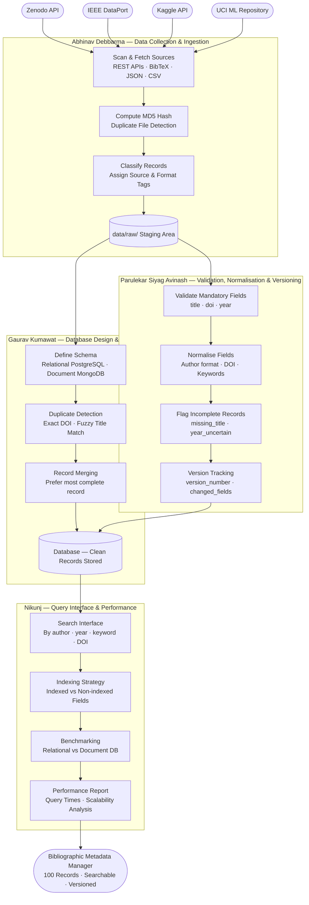

# Research Dataset Catalogue & Bibliographic Metadata Manager

> **DS3294: DS Practice — Project #14**  
> A reproducible, well-documented bibliographic metadata management system for research datasets.

---

## Table of Contents

- [Project Overview](#project-overview)
- [Team Structure](#team-structure)
- [Data Sources](#data-sources)
- [Pre-processing Plan](#pre-processing-plan)
- [Pipeline & Code Structure](#pipeline--code-structure)
- [Testing & Debugging Plan](#testing--debugging-plan)
- [Tech Stack](#tech-stack)
- [Setup & Installation](#setup--installation)
- [Timeline](#timeline)

---

## Project Overview

This project involves designing and implementing a system to collect, manage, and interact with a structured database of bibliographic entries associated with research datasets. The system supports efficient search, validation, deduplication, and curation of metadata.

**Key capabilities:**
- Automated ingestion from multiple structured sources (BibTeX, JSON, CSV, APIs)
- Relational and/or document-based storage of bibliographic metadata
- Validation, normalisation, and deduplication pipeline
- Query interface for browsing by author, year, keyword, repository, or DOI
- Versioning and incremental update support

---

## Team Structure

| Member | Role | Responsibilities |
|--------|------|-----------------|
| Abhinav Debbarma | Data Collection & Ingestion | Source identification, API/file parsers, raw data pipeline |
| Gaurav Kumawat | Database Design & Schema | Schema design, duplicate detection, record merging |
| Parulekar Siyag Avinash | Validation, Normalisation & Versioning | Data cleaning, conflict resolution, versioning logic |
| Nikunj | Query Interface & Performance Analysis | Search/browse interface, indexing strategies, performance benchmarking |

---

## Data Sources

### Primary Sources

| Source | Format | Access Method |
|--------|--------|---------------|
| [Zenodo](https://zenodo.org) | JSON / REST API | Public API — `https://zenodo.org/api/records` |
| [IEEE DataPort](https://ieee-dataport.org) | BibTeX / CSV | Manual export + scraping |
| [Kaggle Datasets](https://www.kaggle.com/datasets) | JSON / CSV | Kaggle API |
| [UCI ML Repository](https://archive.ics.uci.edu) | HTML / BibTeX | Web scraping |

### Data Fields Collected

Each bibliographic record will capture the following fields where available:

```
title, creators/authors, publication_year, repository, doi,
keywords, abstract, access_url, license, file_format,
subject_area, citation_count, date_collected, source_id
```

### Estimated Corpus Size

Target: **100 records** across at least 3 repositories for meaningful performance comparison.

---

## Pre-processing Plan

### Stage 1 — Raw Ingestion
- Parse BibTeX files using `bibtexparser`
- Parse JSON/CSV using `pandas`
- Call REST APIs with `requests`, handle pagination and rate limits
- Store raw records in a staging area before validation

### Stage 2 — Normalisation
- Standardise author name format: `Last, First` → consistent across sources
- Normalise `publication_year` to integer; flag records with missing or malformed dates
- Clean and lower-case `keywords`; split multi-value strings into arrays
- Resolve DOI formatting: strip URL prefixes, keep canonical `10.xxxx/...` format
- Trim whitespace and remove HTML/LaTeX artifacts from text fields

### Stage 3 — Validation
- Check mandatory fields: `title`, `doi` or `source_id`, `publication_year`
- Validate DOI format using regex: `^10\.\d{4,9}/[^\s]+$`
- Flag records with implausible years (before 1900 or after current year)
- Log all validation failures to a separate `rejected_records` table/collection

### Stage 4 — Deduplication
- Primary deduplication: exact DOI match
- Secondary deduplication: fuzzy title matching using `rapidfuzz` (threshold ≥ 90%)
- Manual review queue for near-duplicate records flagged by fuzzy matching
- Record merge strategy: prefer the record with more complete fields; log merge decisions

### Stage 5 — Versioning
- Every update to an existing record creates a new version entry
- Store `version_number`, `updated_at`, `changed_fields` alongside each record
- Soft-delete only: records are marked `is_active = False`, never physically deleted

---

## Pipeline & Code Structure

### Workflow



### Member Responsibilities

**Abhinav Debbarma — Data Collection & Ingestion**
Connects to REST APIs (Zenodo, Kaggle) and parses downloaded files (BibTeX, JSON, CSV) from IEEE DataPort and UCI. Computes MD5 hashes for duplicate detection, classifies records by source and format, and deposits all raw records into the staging area for the next stage.

**Gaurav Kumawat — Database Design & Schema**
Designs and maintains the relational (PostgreSQL) and document-based (MongoDB) schemas that store all bibliographic fields. Implements duplicate detection using exact DOI matching and fuzzy title comparison, and defines the record merging strategy that favours the most complete entry across sources.

**Parulekar Siyag Avinash — Validation, Normalisation & Versioning**
Receives raw records from ingestion and validates mandatory fields (title, DOI, year). Normalises author names, DOI formats, and keywords to a consistent standard. Flags incomplete or conflicting records for review and maintains a full version history for every updated record.

**Nikunj — Query Interface & Performance Analysis**
Builds the search and filtering interface that allows browsing by author, year, keyword, repository, and DOI. Compares indexed vs non-indexed fields and relational vs document-based storage through benchmarking, and documents query performance as the corpus grows.

---

## Testing & Debugging Plan

### Unit Tests

Each module will have a corresponding test file in `tests/`. We use **pytest** as the test framework.

| Module | Test Focus |
|--------|-----------|
| `ingestion/` | Parser correctness for each format; API mock responses; pagination handling |
| `database/` | Schema integrity; duplicate detection accuracy; merge output correctness |
| `processing/` | Normalisation edge cases; validation acceptance/rejection rates; version chain correctness |
| `query/` | Search result correctness; filter combinations; index vs non-index performance |

### Test Data

- **Valid fixture set**: 50 hand-curated records covering all formats and repositories
- **Edge case set**: Records with missing fields, malformed DOIs, duplicate entries, unicode characters, conflicting metadata
- **Performance set**: Synthetic dataset of 100 records generated via script for scalability testing

### Integration Tests

- Full pipeline test: raw file → ingestion → validation → database → query
- Cross-source deduplication test: same dataset present in two repositories
- Versioning test: update a record and verify version history is preserved

### Debugging Approach

- All pipeline stages emit structured logs using Python's `logging` module (level: DEBUG in dev, INFO in prod)
- Rejected records are written to `data/rejected/` with a reason code and timestamp
- A `pipeline_run_log` table tracks each ingestion run: source, records fetched, accepted, rejected, duplicates found
- On schema or query errors, full tracebacks are written to `logs/errors.log`
- Use `pytest --tb=short -v` during development; CI runs on every push via GitHub Actions

### Performance Benchmarking (Nikunj)

- Measure query time for keyword search, author lookup, and DOI lookup at 100 records
- Compare indexed vs non-indexed fields using `EXPLAIN ANALYZE` (PostgreSQL) or equivalent
- Compare relational (PostgreSQL) vs document-based (MongoDB) storage for read-heavy queries
- Results documented in `scripts/benchmark.py` output and summarised in final report

---

## Tech Stack

| Layer | Technology |
|-------|-----------|
| Language | Python 3.11+ |
| Relational DB | PostgreSQL 15 |
| ORM | SQLAlchemy |
| Document DB (optional comparison) | MongoDB |
| Data processing | pandas, bibtexparser, rapidfuzz |
| API calls | requests |
| Testing | pytest |
| Version control | Git + GitHub |
| Environment management | python-dotenv, venv |

---

## Setup & Installation

```bash
# 1. Clone the repository
git clone https://github.com/<your-org>/ds3294-project14.git
cd ds3294-project14

# 2. Create and activate virtual environment
python -m venv venv
source venv/bin/activate        # Windows: venv\Scripts\activate

# 3. Install dependencies
pip install -r requirements.txt

# 4. Configure environment variables
cp .env.example .env
# Edit .env with your DB credentials and API keys

# 5. Initialise the database
python scripts/seed_db.py

# 6. Run the full pipeline
python scripts/run_pipeline.py

# 7. Run tests
pytest tests/ -v
```


---

*Last updated: March 2026*
